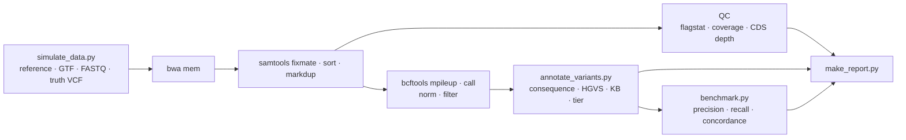

# germline-variant-pipeline

[](https://github.com/Hakan-Cam/germline-variant-pipeline/actions/workflows/ci.yml)

A small, end-to-end **germline small-variant pipeline** in Bash + Python: paired-end FASTQ → aligned BAM → normalised VCF → **consequence annotation, HGVS notation and tiered prioritisation** → Markdown report, with built-in **benchmarking against a truth set** — on synthetic data in CI, and on the **GIAB HG002 reference genome scored with hap.py** (SNP F1 0.994, indel F1 0.940; [`giab/`](giab/)).

It runs in under 10 seconds on a laptop, needs no downloads, and is tested on every push with GitHub Actions.



## Why synthetic data?

Interpreting variants is only trustworthy if you can show the pipeline finds what it should. So the test sample is **designed, not random**: `simulate_data.py` builds a ~10.7 kb chromosome with two genes (one on each strand, multi-exon, canonical GT-AG introns) and plants 19 variants **in transcript (c.) coordinates** so the correct answer is known in advance:

| Designed variant class | Examples |
|---|---|
| Coding SNVs | synonymous, missense, stop-gained, start-lost |
| Indels | 1-bp frameshift deletion, 1-bp frameshift insertion (minus strand), 3-bp in-frame deletion |
| Splicing | donor `c.155+1G>A`, acceptor `c.191-2A>G` |
| Non-coding | deep intronic, intergenic SNVs and indels |
| Genotypes | heterozygous and homozygous-alternate |

The annotator never sees these labels — it has to rediscover each consequence from the VCF, GTF and FASTA alone. The benchmark then checks calls **and** annotations against the truth.

## Quick start

```bash
# Linux / WSL2
sudo apt-get install bwa samtools bcftools tabix     # or: conda env create -f environment.yml
git clone https://github.com/Hakan-Cam/germline-variant-pipeline.git
cd germline-variant-pipeline
./run_pipeline.sh                    # writes results/SAMPLE01.report.md
make test                            # unit tests (pytest)
```

Options: `-o OUTDIR  -s SAMPLE  -t THREADS  -c COVERAGE  -r SEED  -m MIN_F1` (`./run_pipeline.sh -h`).

## Results

Full example report: [`example_output/SAMPLE01.report.md`](example_output/SAMPLE01.report.md)

**Benchmark (40x):**

| Class | TP | FP | FN | Precision | Recall | Genotype concordance | Annotation concordance |
|---|---|---|---|---|---|---|---|
| SNV | 14 | 0 | 0 | 1.000 | 1.000 | 1.000 | 1.000 |
| Indel | 5 | 0 | 0 | 1.000 | 1.000 | 1.000 | 1.000 |

**Tier 1 variants (excerpt):**

| Gene | HGVS c. | HGVS p. | Consequence | Zygosity | Why prioritised |
|---|---|---|---|---|---|
| GENE_A | c.118C>T | p.Arg40Ter | stop_gained | het | Reported Pathogenic in knowledge base |
| GENE_A | c.155+1G>A | p.? | splice_donor_variant | het | Rare predicted loss-of-function |
| GENE_B | c.300_301insA | p.Leu101Thrfs | frameshift_variant | het | Rare predicted loss-of-function |
| GENE_B | c.268C>T | p.Gln90Ter | stop_gained | hom_alt | Rare predicted loss-of-function |
| GENE_B | c.164A>G | p.Lys55Arg | missense_variant | het | Reported Likely_pathogenic in knowledge base |

A missense variant reported **Benign** with population AF 0.12 is correctly demoted to Tier 3, while a missense reported **Likely pathogenic** is promoted to Tier 1 — the same consequence class, triaged differently by external evidence.

**Coverage titration** (`./run_pipeline.sh -c N -m 0`) — recall after the `DP<10` / `QUAL<30` filters:

| Mean depth | SNV recall | Indel recall | Precision |
|---|---|---|---|
| 10x | 0.50 | 0.40 | 1.00 |
| 15x | 0.86 | 0.80 | 1.00 |
| 20x | 1.00 | 1.00 | 1.00 |
| 40x | 1.00 | 1.00 | 1.00 |

## Real-data benchmark: GIAB HG002 chr20 + hap.py

[`giab/run_giab_chr20.sh`](giab/) runs the same `bwa mem → markdup → bcftools` steps (shared via `lib/steps.sh`) on real Illumina 35x reads from **HG002**, re-aligned from FASTQ, and scores the calls with **hap.py** (vcfeval engine) against the **NIST v4.2.1** truth set in GIAB confident regions.

```bash
giab/run_giab_chr20.sh -R chr20:10000000-15000000   # quick 5 Mb test
giab/run_giab_chr20.sh -R chr20 -t 16               # full chromosome 20
```

**Result — HG002, chr20:10,000,000–15,000,000** (35x, 646,959 read pairs re-aligned; 7,248 truth variants; 4.91 Mb confident; GitHub-hosted runner, 4 threads, ~2 min pipeline time):

| Type | Filter | Truth | TP | FN | FP | Recall | Precision | F1 |
|---|---|---|---|---|---|---|---|---|
| SNP | PASS | 6,037 | 5,983 | 54 | 13 | 0.9911 | 0.9978 | **0.9944** |
| SNP | ALL | 6,037 | 5,997 | 40 | 29 | 0.9934 | 0.9952 | 0.9943 |
| INDEL | PASS | 1,018 | 947 | 71 | 50 | 0.9303 | 0.9497 | **0.9399** |
| INDEL | ALL | 1,018 | 960 | 58 | 57 | 0.9430 | 0.9438 | 0.9434 |

What the numbers say:

- **SNPs are called at >99% recall and precision**, as expected for 35x PCR-free data with bwa + bcftools.
- **Indels are the weak point, and mostly because of genotyping, not detection:** 48 of the 50 PASS indel false positives are at true variant sites with the wrong zygosity (hap.py counts each of these as both an FP and an FN).
- **One generic filter does not fit both classes.** `QUAL<30 || DP<10` halves SNP false positives (29 → 13) at almost no cost to F1, but for indels it removes more true positives (13) than false ones (7), so indel F1 drops. Variant-type-specific filtering, or a model-based caller such as DeepVariant or GATK HaplotypeCaller (local re-assembly), is the obvious next step for indels.

It can also be launched with no local setup from **Actions → giab-hg002-benchmark → Run workflow**; the hap.py table is posted to the run summary. See [`giab/README.md`](giab/README.md) for data sources and design notes.

## Repository layout

```
run_pipeline.sh              orchestration: strict mode, logging, error trap, version capture
lib/steps.sh                 shared align_reads / call_variants (parallel scatter-gather) functions
giab/run_giab_chr20.sh       real-data benchmark: HG002 chr20, NIST v4.2.1 truth, hap.py
scripts/
  simulate_data.py           synthetic genome, GTF, diploid 2x150 reads, truth VCF, toy knowledge base
  annotate_variants.py       consequence prediction, HGVS c./p., KB join, tiering
  benchmark.py               precision/recall/F1, genotype + annotation concordance (CI gate)
  make_report.py             Markdown report
  summarize_happy.py         hap.py summary.csv -> Markdown / JSON
tests/                       unit tests (+ / - strand transcripts, tiering, hap.py parsing)
.github/workflows/ci.yml     tests + synthetic pipeline + GIAB-script smoke test on every push
.github/workflows/giab.yml   manual GIAB HG002 + hap.py benchmark run
example_output/              report and tables from a reference run
```

## Pipeline details

| Step | Tool / logic |
|---|---|
| Alignment | `bwa mem` with read groups → `samtools fixmate -m` → `sort` → `markdup` |
| QC | `samtools flagstat`, `samtools coverage`, per-base depth over coding exons (GTF → BED with `awk`), % bases ≥20x |
| Calling | `bcftools mpileup -q20 -Q20 -a AD,DP` → `bcftools call -mv`, scattered over genomic windows in parallel (`xargs -P`) and gathered with `bcftools concat` |
| Normalisation | `bcftools norm -m -any` (left-align, split multi-allelics); the truth set is normalised identically before comparison |
| Filtering | soft filter `LowQual` for `QUAL<30 \|\| DP<10` (records kept, flagged) |
| Annotation | CDS reconstruction from GTF + FASTA, strand-aware; consequence from translated ref vs alt protein; Sequence Ontology terms with VEP-style impact (HIGH/MODERATE/LOW/MODIFIER) |
| Prioritisation | Tier 1: reported P/LP or rare HIGH-impact · Tier 2: rare MODERATE-impact (VUS-like) · Tier 3: reported B/LB, AF ≥ 1%, or low impact |

## Limitations and next steps

This is a compact demonstration, not a clinical pipeline.

- **Data:** the annotation/tiering demo uses a synthetic genome and toy knowledge base; real-data accuracy is measured separately on GIAB HG002 chr20. Next: GIAB difficult-region stratifications in hap.py.
- **Annotation:** coding-only transcripts (no UTRs); simplified HGVS (no 3′ shifting, insertions not rewritten as `dup` — e.g. the in-frame deletion is reported left-aligned as `c.399_401del`). Production use would rely on VEP/SnpEff with MANE transcripts, ClinVar and gnomAD.
- **Classification:** the tiers are ACMG-*inspired* triage rules, not ACMG/AMP classification.
- **Workflow:** a single Bash script keeps this readable; a larger version would move to Snakemake or Nextflow with containers and GATK HaplotypeCaller/DeepVariant.

## Author

Hakan Cam, Ph.D. · [github.com/Hakan-Cam](https://github.com/Hakan-Cam)
